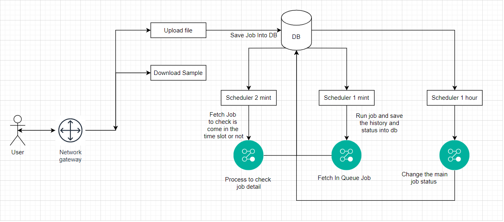
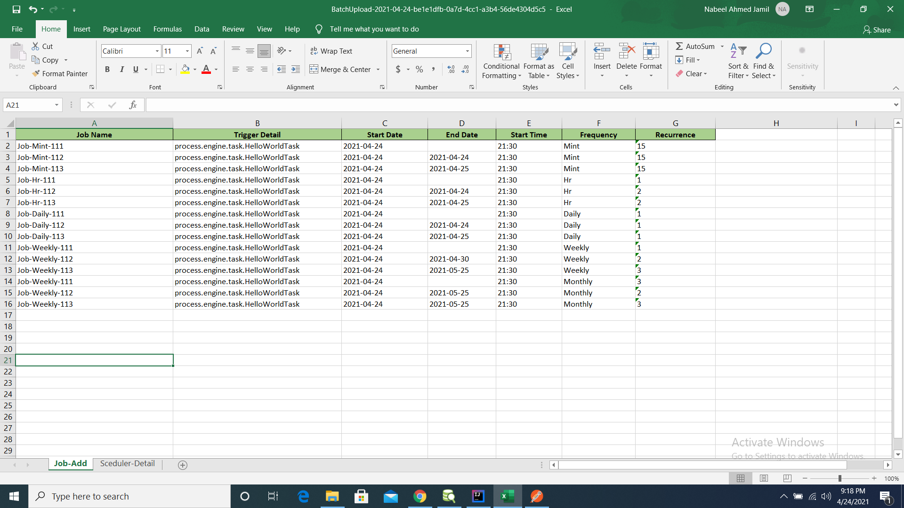

# Process
#### This project use to create the scheduler and scheduler run base on target time
`Process have 5 type of scheduler`<br>
1. Mint (scheduler run mint ex => every 5 mint)
2. Hr (scheduler run hr ex => every 1 hr)
3. Daily (scheduler run daily base)
4. Weekly (scheduler run base weekly)
5. Monthly (scheduler run base monthly)

## Helping Query for view and run this project
```
-- Run this query after project run this is the basic setting
insert into lookup_data values
('1001','2021-03-31 22:09:43.244','This Scheduler use for send the job into the queue','2021-04-01T00:16:34.567','SCHEDULER_LAST_RUN_TIME'),
('1002','2021-03-31 23:06:48.744','This Queue fetch size use to fetch the limit of data from db','25','QUEUE_FETCH_LIMIT');

-- Query help to view the scheduler detail only show which are 'InFlight'
select scheduler.* from scheduler
inner join job on scheduler.job_id=job.job_id
where (('2021-04-25' BETWEEN start_date AND end_date) OR (start_date <= '2021-04-25' AND end_date is null))
and job.job_status = 'Active'
and (job.job_running_status is null or job.job_running_status = 'InFlight');


select * from job;
select * from job_history where job_status = 'Queue';
select * from lookup_data;
select * from job_audit_logs where job_id = 1179 order by job_audit_log_id desc;
```

## Process Endpoint
1. Endpoint use download batch file <br>
   http://localhost:8080/scheduler.json/downloadBatchSchedulerTemplateFile
2. Endpoint use upload batch file <br>
   http://localhost:8080/scheduler.json/uploadBatchSchedulerFile

## Process Structure

## Images for sample xlsx with data



## ELK Strcuture
Process logs strcuture


   


