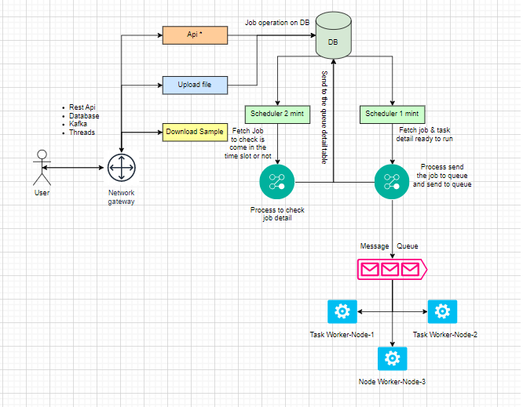
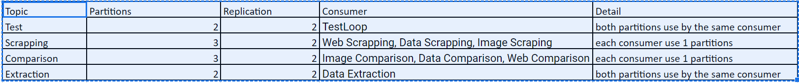

<table>
  <tr>
    <th>Task</th>
    <th>Status</th>
  </tr>
    <tr>
    <td>OpenId Auth</td>
    <td>Pending</td>
  </tr>
</table>

# Process
This repo is scheduler engine which is used to handle the sourceJob scheduler.<br>
Project is using kafka for real-time stream processing<br>
#### This project use to create the scheduler and run base on target time
`Process have 5 type of scheduler`<br>
1. Mint (scheduler run mint ex => every 5 mint)
2. Hr (scheduler run hr ex => every 1 hr)
3. Daily (scheduler run daily base)
4. Weekly (scheduler run base weekly)
5. Monthly (scheduler run base monthly)

## Helping Query for view and run this project
```
Note :- Before run this project execute the below script.
INSERT INTO lookup_data VALUES
('1001','2021-03-31 22:09:43.244','This Scheduler use for send the sourceJob into the queue','2021-04-01T00:16:34.567','SCHEDULER_LAST_RUN_TIME'),
('1002','2021-03-31 23:06:48.744','This Queue fetch size use to fetch the limit of data from db','25','QUEUE_FETCH_LIMIT');

INSERT INTO source_task_type (source_task_type_id, description, queue_topic_partition, service_name)
VALUES ('1000', '[consumer test]', 'topic=test-topic&partitions=[*]', 'Test');

INSERT INTO source_task_type (source_task_type_id, description, queue_topic_partition, service_name)
VALUES ('1001', '[only for file type (non of image)]', 'topic=scrapping-topic&partitions=[0]', 'Web Scrapping');

INSERT INTO source_task_type (source_task_type_id, description, queue_topic_partition, service_name)
VALUES ('1002', '[only html data to other format (xml|css|xlsx|json)]', 'topic=scrapping-topic&partitions=[1]', 'Data Scrapping');

INSERT INTO source_task_type (source_task_type_id, description, queue_topic_partition, service_name)
VALUES ('1003', '[only image scrapping diff type of image]', 'topic=scrapping-topic&partitions=[2]', 'Image Scraping');

INSERT INTO source_task_type (source_task_type_id, description, queue_topic_partition, service_name)
VALUES ('1004', '[only for monitoring]', 'topic=comparison-topic&partitions=[0]', 'Image Comparison');

INSERT INTO source_task_type (source_task_type_id, description, queue_topic_partition, service_name)
VALUES ('1005', '[only for monitoring]', 'topic=comparison-topic&partitions=[1]', 'Data Comparison');

INSERT INTO source_task_type (source_task_type_id, description, queue_topic_partition, service_name)
VALUES ('1006', '[only for monitoring]', 'topic=comparison-topic&partitions=[2]', 'Web Comparison');

INSERT INTO source_task_type (source_task_type_id, description, queue_topic_partition, service_name)
VALUES ('1007', '[user uplaod file xlsx|css and extract the data as per the requirement and reportment (json|xlsx|css|xlsx)]', 'extraction-topic&partitions=[*]', 'Data Extraction');

INSERT INTO source_task_type (source_task_type_id, description, queue_topic_partition, service_name)
VALUES ('1008', '[Boots for web base automation]', 'Web Auto Bots', 'Web Auto Bots');

INSERT INTO source_task_type (source_task_type_id, description, queue_topic_partition, service_name)
VALUES ('1009', '[Boots for Mobile automation]', 'Mobile Auto Bots', 'Mobile Auto Bots');

INSERT INTO source_task_type (source_task_type_id, description, queue_topic_partition, service_name)
VALUES ('1010', '[Data|1st Dimension Statistics | 2nd Dimension Statistics]', 'Data Statistics Report', 'Data Statistics Report');

-- Task Detail for test
INSERT INTO task_detail (task_detail_id, task_payload, task_status, source_job_type_id) 
VALUES (1000, '{"testLoop":{"start":0,"end":1000}}', 'Active', '1000');

INSERT INTO task_detail (task_detail_id, task_payload, task_status, source_job_type_id) 
VALUES (1001, '{"testLoop":{"start":0,"end":10000}}', 'Active', '1000');

update task_detail set task_name = 'Test Source 1' where task_detail_id = 1000;
update task_detail set task_name = 'Test Source 2' where task_detail_id = 1001;

-- Query help to view the scheduler detail only show which are 'InFlight'
select scheduler.* from scheduler
inner join source_job on scheduler.job_id=source_job.job_id
where (('2021-04-25' BETWEEN start_date AND end_date) OR (start_date <= '2021-04-25' AND end_date is null))
and source_job.job_status = 'Active'
and (source_job.job_running_status is null or source_job.job_running_status = 'InFlight');

select scheduler.* from scheduler
inner join source_job on scheduler.job_id=source_job.job_id
where (('2021-04-25' BETWEEN start_date AND end_date) OR (start_date <= '2021-04-25' AND end_date is null))
and source_job.job_status = 'Active'
and (source_job.job_running_status is null or source_job.job_running_status = 'InFlight');

select * from sourceJob;
select * from job_queue where job_status = 'Queue';
select * from lookup_data;
select * from job_audit_logs where job_id = 1179 order by job_audit_log_id desc;

select job_queue.*
from job_queue
inner join source_job on source_job.job_id = job_queue.job_id
where
date(job_queue.date_created) = '2022-10-22' and extract(hour from cast(job_queue.date_created as time)) = 18 and
job_queue.job_id = 1003 and job_queue.job_status = 'Completed';

select job_queue.job_id, source_job.job_name,
count (case when job_queue.job_status = 'Queue' then job_queue.job_id end) as Queue,
count (case when job_queue.job_status = 'Running' then job_queue.job_id end) as Running,
count (case when job_queue.job_status = 'Failed' then job_queue.job_id end) as Failed,
count (case when job_queue.job_status = 'Completed' then job_queue.job_id end) as Completed,
count (case when job_queue.job_status = 'Stop' then job_queue.job_id end) as Stop,
count (case when job_queue.job_status = 'Skip' then job_queue.job_id end) as Skip,
count (*) as total
from job_queue
inner join source_job on source_job.job_id = job_queue.job_id
--where 
date(job_queue.date_created) = '%s' and extract(hour from cast(job_queue.date_created as time)) = %d
group by job_queue.job_id, source_job.job_name
union
select "" as job_id, "" as job_name,
count (case when job_queue.job_status = 'Queue' then job_queue.job_id end) as Queue,
count (case when job_queue.job_status = 'Running' then job_queue.job_id end) as Running,
count (case when job_queue.job_status = 'Failed' then job_queue.job_id end) as Failed,
count (case when job_queue.job_status = 'Completed' then job_queue.job_id end) as Completed,
count (case when job_queue.job_status = 'Stop' then job_queue.job_id end) as Stop,
count (case when job_queue.job_status = 'Skip' then job_queue.job_id end) as Skip,
count (*) as total
from job_queue
inner join source_job on source_job.job_id = job_queue.job_id
--where date(job_queue.date_created) = '%s' and extract(hour from cast(job_queue.date_created as time)) = %d
order by job_id asc;

select sum(temp_tab.queue) as total_queue , sum(temp_tab.running) as total_running,
sum(temp_tab.failed) as total_failed, sum(temp_tab.completed) as total_completed,
sum(temp_tab.stop) as total_stop, sum(temp_tab.skip) as total_ski, sum(temp_tab.total) as total
from (select job_queue.job_id,
count (case when job_queue.job_status = 'Queue' then job_queue.job_id end) as Queue,
count (case when job_queue.job_status = 'Running' then job_queue.job_id end) as Running,
count (case when job_queue.job_status = 'Failed' then job_queue.job_id end) as Failed,
count (case when job_queue.job_status = 'Completed' then job_queue.job_id end) as Completed,
count (case when job_queue.job_status = 'Stop' then job_queue.job_id end) as Stop,
count (case when job_queue.job_status = 'Skip' then job_queue.job_id end) as Skip,
count (*) as total
from job_queue
inner join source_job on source_job.job_id = job_queue.job_id
where date(job_queue.date_created) = '2022-10-12' and extract(hour from cast(job_queue.date_created as time)) = 12
group by job_queue.job_id
order by job_queue.job_id desc) as temp_tab;

// add the case
select  '"' || start_time || '\n' || job_id ||'-' ||job_queue_id || '",'  as job_start_time,
extract(epoch from (end_time-start_time)) as sec
from job_queue
where date(start_time) = '2022-10-12'
and extract(hour from cast(job_queue.date_created as time)) = 12;

select job_id, job_queue_id, date_created, start_time, end_time, skip_time, job_status
from job_queue 
where cast(date_created as date) between '2022-10-14' and '2022-10-21'
order by job_queue_id desc

select weekData.daycode, weekData.hr, weekData.date, count(*)
from (
select job_queue_id, to_char(cast(date_created as date), 'Day') as daycode, 
cast(date_created as date) as date, cast(date_created as time) as time, 
extract(hour from cast(date_created as time)) as hr
from job_queue where date(date_created) between '2022-10-11' and '2022-10-17') as weekData
group by weekData.daycode, weekData.hr, weekData.date;

select job_status, count(*) as total_count
from job_queue 
where cast(date_created as date) between '2022-10-12' and '2022-10-12'
--and job_id in (1502, 1503) 
--and job_queue_id in (2738, 2862)
--and job_status in ('Running','Completed','Failed')
group by job_status;

```
## Process Endpoint
List of endpoint with detail of endpoint
1. Endpoint use download batch file <br>
   http://localhost:9098/api/v1/bulk.json/downloadBatchSchedulerTemplateFile
2. Endpoint use upload batch file <br>
   http://localhost:9098/api/v1/bulk.json/uploadBatchSchedulerFile
## Video For Screen's
[](ext-detail/screen-capture.webm)
## UI Job Status
Below image show the task status color for UI.<br>


[//]: # (## Process Structure)
[//]: # (1. Below image show the process structure with new enhancement. <br>)
[//]: # (![alt text]&#40;ext-detail/strcture.png&#41; <br>)

2. Below image show the kafka structure which implement in the project.
To run the kafka use the below cmd
   1. Start Apache Zookeeper.<br>
      .\bin\windows\zookeeper-server-start.bat .\config\zookeeper.properties (for window) <br>
      ./zookeeper-server-start.sh ../config/zookeeper.properties
   2. Start the Kafka server.<br>
      ./kafka-server-start.sh ../config/server.properties (for window) <br>
      .\bin\windows\kafka-server-start.bat .\config\server.properties


To start the Kafka server.
   1. To create the cluster for below detail download and install the 'Kafka Offset Explorer'.
   
## Process DB-UML
Below image show the detail for database detail for process. <br>


