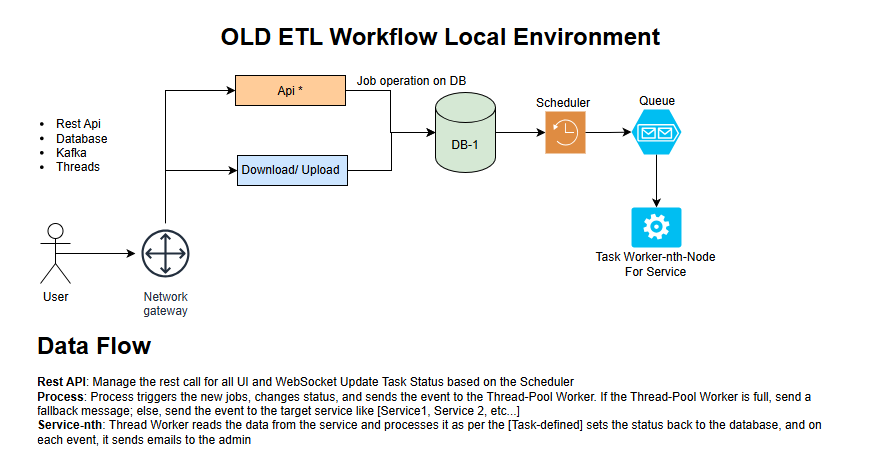
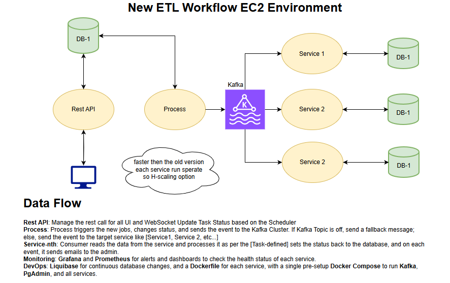
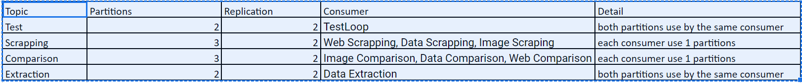
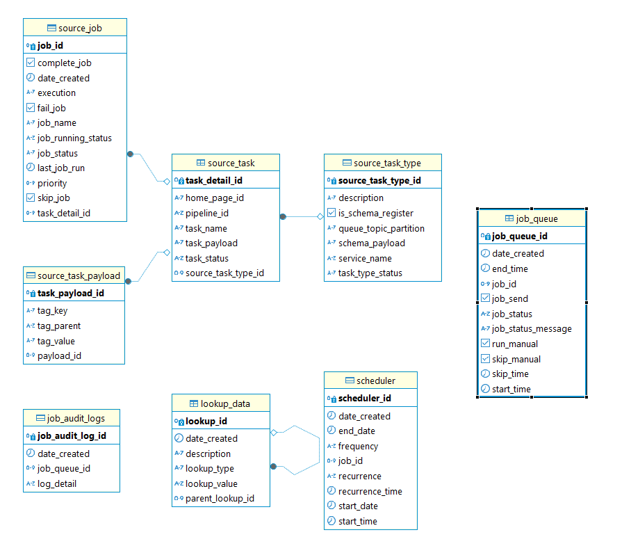

# Scheduler Engine

### Overview
This project is a **Scheduler Engine** designed to efficiently manage and execute source jobs.  
It leverages **Apache Kafka** for real-time stream processing, providing scalability, fault tolerance, and high throughput for job execution workflows.

```
There are 5 types of schedulers:
1. Minute (runs every few minutes, e.g., every 5 minutes)
2. Hourly (runs every few hours, e.g., every 1 hour)
3. Daily (runs once per day)
4. Weekly (runs once per week)
5. Monthly (runs once per month)
```

### Features
- **Job Scheduling** – Supports periodic, delayed, and priority-based job execution.  
- **Real-Time Stream Processing** – Uses Kafka producers and consumers to process jobs as messages.  
- **Scalability** – Distributed architecture for handling a large volume of jobs concurrently.  
- **Fault Tolerance** – Kafka ensures message durability and recovery in case of failure.  
- **Prioritized Task Execution** – Executes tasks based on defined priority levels using a queue system.  
- **Thread Pool Execution** – Uses `ThreadPoolExecutor` with a `PriorityBlockingQueue` for efficient parallel job handling.

### Architecture
1. **Producer** – Sends job/task messages to Kafka topics.  
2. **Scheduler Engine** – Pulls tasks, applies scheduling logic, and enqueues them for execution.  
3. **Consumer** – Reads processed results or error events from Kafka.  
4. **Executor** – Runs prioritized tasks concurrently using a thread pool.

### Tech Stack
- **Java / Spring Boot** – Core backend engine  
- **Apache Kafka** – Real-time messaging and stream processing  
- **PostgreSQL** – (Optional) Persistence for metadata and job tracking

### Use Cases
- ETL job scheduling and execution  
- Data pipeline orchestration  
- Real-time stream processing  
- Event-driven workflows

### Running the Project
```bash
# Clone the repository
git clone https://github.com/NABEEL-AHMED-JAMIL/process/tree/split-mono-to-microservice

# Navigate into the project directory
cd process

# Build the project
mvn clean install

# Run the application
mvn spring-boot:run
```

### ETL Workflow Diagram
Below are the existing workflow details of the process.

#### 1. Old ETL Workflow Diagram


#### 2. New ETL Workflow Diagram


---

## Helper Queries for Viewing and Running the Project
> **Note:** Before running the project, execute the following SQL scripts.

```sql
INSERT INTO lookup_data VALUES
('1001','2021-03-31 22:09:43.244','This scheduler sends source jobs into the queue','2021-04-01T00:16:34.567','SCHEDULER_LAST_RUN_TIME'),
('1002','2021-03-31 23:06:48.744','Defines the fetch size limit for retrieving data from the database','25','QUEUE_FETCH_LIMIT');

INSERT INTO source_task_type (source_task_type_id, description, queue_topic_partition, service_name)
VALUES ('1000', '[consumer test]', 'topic=test-topic&partitions=[*]', 'Test');
```

---

## Process Endpoints
List of available endpoints with their descriptions:

1. **Download Batch File**  
   `http://localhost:9098/api/v1/bulk.json/downloadBatchSchedulerTemplateFile`
2. **Upload Batch File**  
   `http://localhost:9098/api/v1/bulk.json/uploadBatchSchedulerFile`

### Kafka Setup
1. **Start Apache Zookeeper**
   ```bash
   .\bin\windows\zookeeper-server-start.bat .\config\zookeeper.properties   # Windows
   ./zookeeper-server-start.sh ../config/zookeeper.properties                  # Linux/Mac
   ```

2. **Start the Kafka Server**
   ```bash
   .\bin\windows\kafka-server-start.bat .\config\server.properties   # Windows
   ./bin/kafka-server-start.sh ./config/server.properties                 # Linux/Mac
   ```

3. **View Cluster Details**
   Use **Kafka Offset Explorer** to view cluster and topic details.  
   

---

### Process Database UML
The image below shows the database design details for the process.  


---

### Monitoring (Grafana & Spring Boot Actuator)
Spring Boot Actuator is enabled in this project to provide production-ready features such as monitoring, health checks, metrics, and system information.  
It exposes endpoints that allow developers and operators to monitor the application, debug issues, and integrate with monitoring tools like Prometheus and Grafana.

The exposed endpoints include:
- Application health  
- Metrics  
- Configuration properties  
- Environment details  
- Loggers  
- Liquibase migration status  
- Scheduled tasks  
- Request mappings  

These endpoints make it easier to monitor the application in real time and ensure smooth operation in production.

```json
{
  "_links": {
    "self": { "href": "http://localhost:9098/api/v1/actuator", "templated": false },
    "beans": { "href": "http://localhost:9098/api/v1/actuator/beans", "templated": false },
    "caches": { "href": "http://localhost:9098/api/v1/actuator/caches", "templated": false },
    "health": { "href": "http://localhost:9098/api/v1/actuator/health", "templated": false },
    "info": { "href": "http://localhost:9098/api/v1/actuator/info", "templated": false },
    "liquibase": { "href": "http://localhost:9098/api/v1/actuator/liquibase", "templated": false },
    "loggers": { "href": "http://localhost:9098/api/v1/actuator/loggers", "templated": false },
    "metrics": { "href": "http://localhost:9098/api/v1/actuator/metrics", "templated": false },
    "prometheus": { "href": "http://localhost:9098/api/v1/actuator/prometheus", "templated": false },
    "scheduledtasks": { "href": "http://localhost:9098/api/v1/actuator/scheduledtasks", "templated": false },
    "mappings": { "href": "http://localhost:9098/api/v1/actuator/mappings", "templated": false }
  }
}
```
