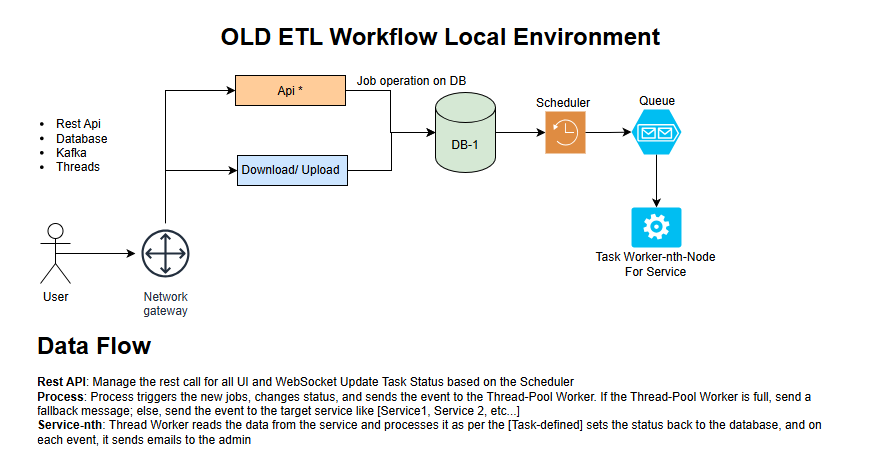
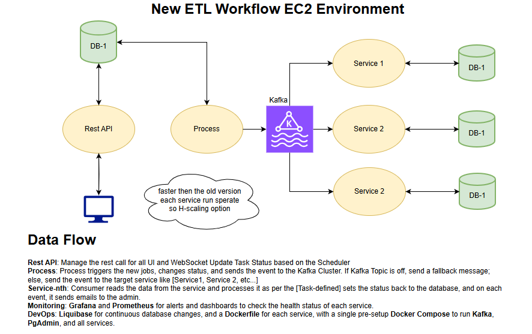
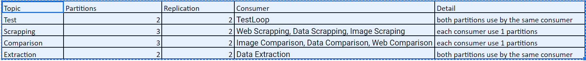
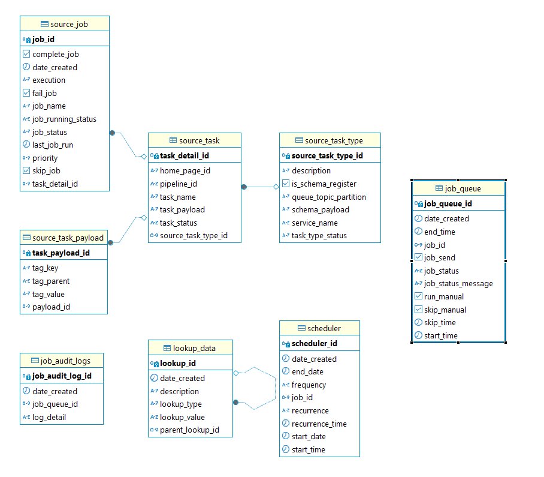

# ETL Console — backend

The server behind the ETL Console. It began as a Kafka-backed **scheduler engine**, and that is still its core, but it has grown well past it: 27 REST controllers now cover multi-tenancy, storage, AI agents, document and audio tooling, a query engine, dynamic forms and more.

Its frontend lives in [`../scheduler1`](../scheduler1) — currently mid-rewrite, with an Angular 8 app deployed and an Angular 22 app replacing it.

> The planning and per-feature scope for the current phase is in [`../.ai/`](../.ai/). Start with [`../.ai/project.md`](../.ai/project.md), and see [`../.ai/discovery/backend.md`](../.ai/discovery/backend.md) for the full endpoint and service inventory.

## The scheduler

```
Process has 5 types of scheduler
1. Mint    (runs on a minute interval,  e.g. every 5 minutes)
2. Hr      (runs hourly,                e.g. every 1 hour)
3. Daily
4. Weekly
5. Monthly
```

These are exactly the values of `process.model.enums.Frequency`.

### Architecture

1. **Producer** — sends job/task messages into Kafka topics
2. **Scheduler engine** — pulls due jobs, applies scheduling logic, dispatches them
3. **Consumer** — reads results and error events back off Kafka
4. **Workers** — the Python services in [`../job-search`](../job-search) consume the topics and do the work

Concurrency comes from Spring's own scheduling pool, sized by `spring.task.scheduling.pool.size`. (Earlier versions of this README described a `ThreadPoolExecutor` with a `PriorityBlockingQueue`; no such code exists today.)

## Tech stack

| | |
|---|---|
| **Java / Spring Boot 2.3.2** | Core engine. Java 8 source level, JDK 17 runtime |
| **Apache Kafka** (`cp-kafka` 7.5.0 + ZooKeeper) | Messaging and stream processing |
| **PostgreSQL 15** | Required, not optional. Schema managed by **Liquibase** (`src/main/resources/db/changelog/`, V1.0 → V25.0) |
| **Redis** | Caching |
| **MinIO** | Object storage; S3 and Azure Blob also supported per connection |
| **jodconverter / LibreOffice** | Document conversion |
| **Spring Security + JWT** | Three roles: `PLATFORM_ADMIN` > `TENANT_ADMIN` > `TENANT_USER` |

`docker-compose.yml` additionally runs `kafka_ui` and `redisinsight`.

## Running

### Option 1 — local

```bash
git clone https://github.com/NABEEL-AHMED-JAMIL/process.git
cd process
mvn clean package -DskipTests
java -jar target/*.jar
```

The branch this workspace is on is `new-screen-2026`.

### Option 2 — Docker Compose (recommended)

```bash
# Build the JAR first — the Dockerfile COPYs a prebuilt jar rather than building one
mvn clean package -DskipTests

# Start PostgreSQL, ZooKeeper, Kafka, Redis, Kafka UI, RedisInsight and the app
docker-compose up -d

docker-compose logs -f
docker-compose down
```

> **The Dockerfile copies a prebuilt jar.** `mvn test` does not write one, so a build run after only testing ships whatever jar was there before. If you are deploying a change, verify what actually shipped — compare the checksum of the jar inside the image against `target/`. This has silently shipped stale code more than once.

| | URL |
|---|---|
| API | `http://localhost:9098/api/v1` |
| Swagger UI | `http://localhost:9098/api/v1/swagger-ui.html` |
| Health | `http://localhost:9098/api/v1/actuator/health` |

Schema migration is automatic — Liquibase runs on startup, and `ModelApplication` seeds `SCHEDULER_LAST_RUN_TIME` if it is absent without overwriting an existing value. **No manual bootstrap SQL is needed;** the statements older versions of this README carried no longer match the tables.

## Bulk template endpoints

```
GET  /api/v1/sourceJob.json/downloadSourceJobTemplateFile
POST /api/v1/sourceJob.json/uploadSourceJob
GET  /api/v1/sourceTask.json/downloadSourceTaskTemplate
POST /api/v1/sourceTask.json/uploadSourceTask
```

(These replace the `bulk.json` endpoints named in earlier versions of this file; that controller no longer exists.)

## Tests

| Suite | Command | Count |
|---|---|---|
| Unit | `mvn -o test` | 516 |
| End-to-end, over real HTTP | `./run-e2e.sh` | 86 |
| Kafka security matrix, real broker | `./run-kafka-matrix.sh` | 17 |

`run-e2e.sh` reads the database credentials and the encryption key from the running `process_app` container, so the stack must be up. `run-kafka-matrix.sh` **must** run in a container — every listener on the test broker is advertised as `host.docker.internal`, which the host cannot resolve, and a host run fails with metadata timeouts that look nothing like the cause. Bring that broker up with `kafka-it/start.sh`.

## Monitoring

Spring Boot Actuator is enabled, deliberately narrowed to:

```
management.endpoints.web.exposure.include=health,info,metrics,prometheus
management.endpoint.shutdown.enabled=false
```

The rest — `env`, `configprops`, `heapdump`, `threaddump`, `beans` and the others — are **off on purpose**: they leak configuration and secrets. `prometheus` is there for Grafana.

## Diagrams

| | |
|---|---|
| Old ETL workflow |  |
| New ETL workflow |  |
| Kafka topic structure |  |
| Database UML |  |

## Note on the wider documentation

Five further markdown files exist under `ext-detail/md/` and `docs/design/` that are not linked from here and have not been verified. Treat them as unknown. The superseded content of this README — the bootstrap SQL and the actuator endpoint dump — is preserved in [`../.ai/old-scope/`](../.ai/old-scope/).
